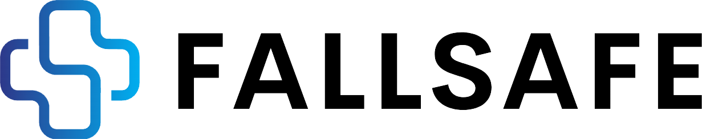
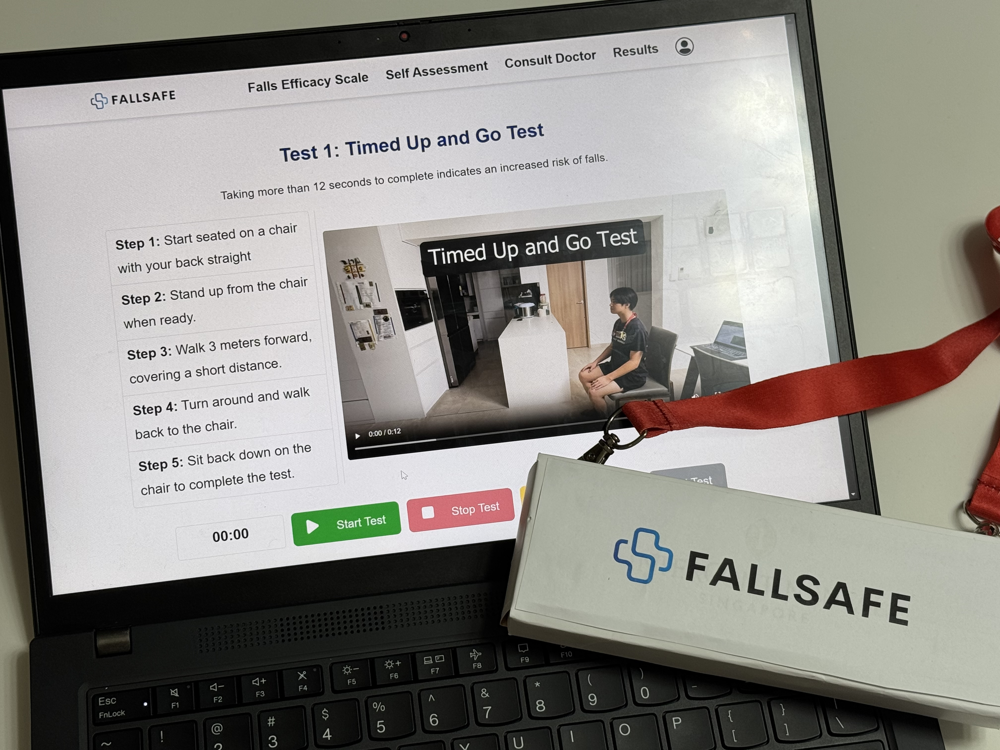

# 

## How to Run the Project

### **Method 1: Hosted Version**

1. **Visit the Hosted Project**:
   Open your browser and navigate to:
   [FallSafe Hosted Version](http://52.221.228.170:8000/)

---

### **Method 2: Local Kubernetes Deployment**

1. **Clone the Repository**:

```

git clone https://github.com/CheeGuang/FallSafe

```

2. **Request the Environment File**:

- Contact the administrator (Jeffrey, @CheeGuang on Telegram) to obtain the `.env` file and place it in the root directory.

3. **Run Kubernetes Deployment**:

```

deploy-k8s.bat

```

4. **Perform Port Forwarding**:

```
port-forward-all.bat
```

5. **Access the Application**:

- Open your browser and navigate to `http://localhost:8080`.

---

## Introduction

<div style="display: flex; justify-content: center">



</div>

This project is developed for **Dell InnoDash 2025**, a hackathon where our key stakeholder is **Lions Befrienders**. The problem statement we are addressing is:

**How might we use Technology to offer an easy and user-friendly way for seniors to perform preliminary self-assessment in the comfort of their own homes, with vulnerable cases being highlighted for further clinical assessment by doctors?**

Our solution is a **100% Cloud Native** application with **Microservice Architecture**, allowing seniors to take the **Falls Efficacy Scale test** and perform **physical self-assessments** from the comfort of their homes.

### **Unique Selling Point**

<div style="display: flex; justify-content: center">


</div>

We integrate **IoT and AI** into our solution to enhance user experience:

- A **multi-lingual Text-to-Speech model** guides users on how to perform tests.
- The **FallSafe Device** tracks real-time body movements and sends data to our Cloud application via **AWS IoT Core**.
- The system processes this data to generate a **comprehensive and easy-to-understand result dashboard**.

After completing a test, users:

- Receive **$10 NTUC Vouchers**.
- Can **schedule a teleconsultation** with a doctor via **Calendly**, which integrates with **Google Calendar and Google Meet**.

On the **admin side**:

- They can **track users who have not completed their tests** and send reminders.

## Future Expansions

<div style="display: flex; justify-content: center">

</div>

We plan to integrate **FallSafe** into **Lions Befrienders' Our Kampung Application**, enabling users to leverage their **mobile phone's gyroscope as a Body Motion Tracker**. This reduces the need for separate motion tracking devices, lowering costs and improving scalability.

Additionally, we can tap into the **Smart Nation Singapore initiative** by leveraging the **Mobile Access for Seniors** program, which provides a **2-year mobile plan at $5.10 per month**. This will enable seamless digital inclusion, ensuring seniors have access to **FallSafe** without financial barriers.

### **What is Our Kampung?**

**Our Kampung** is an application by **Lions Befrienders (LB)** aimed at **bridging the digital divide for seniors** by providing access to digital services, health tracking, and community engagement.

### **What is Smart Nation's Mobile Access for Seniors?**

The **Smart Nation Mobile Access for Seniors** initiative offers a **2-year mobile plan at $5.10 per month**, enabling seniors to stay connected affordably. This initiative ensures digital inclusion and accessibility, making it easier for seniors to engage with technology-driven solutions like **FallSafe**.

## User Testing

<div style="display: flex; justify-content: center; gap: 20px;">
    
    
</div>

In total, we conducted **5 Official User Tests** with individuals aged **55-85 years old**. Through these sessions, we gathered valuable feedback to fine-tune **Fall Risk calculations**, enhance **UI/UX** for elderly users, and help them become more independent in their fall risk assessments. These tests also helped identify edge case bugs and improve the representation of results in the **Dashboard**.

Each test included:

- Evaluation of the **Falls Efficacy Scale**, **Self-Assessment**, and **Dashboard** for fall risk analytics.
- Unmoderated free-roam time to explore the website and interact with the system independently.

FallSafe saw significant improvements with each iteration, ensuring a more user-friendly and accurate experience for seniors.

## Network Architecture

The **FallSafe** architecture is designed as a **Cloud-Native Microservice-Based System** to maximize **ROI** and **operational efficiency** while ensuring resilience and adaptability. This approach allows the system to **react to failures, recover quickly, and minimize business impact**.

### 

### **Key Cloud-Native Concepts Utilized:**

1. **Microservices Architecture**

   - Each core function (User, Authentication, Admin, Self-Assessment, Falls Efficacy Scale, and OpenAI) is **independently containerized** using **Docker** and orchestrated via **Kubernetes**.
   - This enables **scalability, fault isolation, and service independence**, allowing parts of the system to be updated or recovered without affecting the entire application.

2. **Kubernetes & Auto Scaling**

   - The system is deployed on **AWS EC2 instances running Kubernetes**, ensuring **automated scaling and high availability**.
   - Load balancing and resource allocation dynamically adjust based on user demand, **optimizing costs** and improving **performance stability**.

3. **AWS Security & Monitoring**

   - The architecture leverages **AWS WAF, Shield, GuardDuty, and IAM** for **robust security enforcement**.
   - **AWS CloudWatch and AWS CloudTrail** provide real-time **monitoring, logging, and auditing**, enabling rapid **issue detection and resolution**.
   - **CloudWatch Alarms** are configured with **SNS notifications**, alerting administrators to critical system events, ensuring proactive issue management and minimizing downtime.
   - Data is stored on **Aiven's Cloud MySQL Database**, which offers a **99.99% SLA** and complies with **ISAE 3000, ISO 27000, GDPR, CCPA, HIPAA, and PCI DSS** security standards.

4. **IoT Integration**

   - **FallSafe Device** (ESP32S3) connects via **AWS IoT Core** using **MQTT Message Queue**, transmitting real-time motion data to the cloud.
   - The **frontend connects to the application via WebSockets** for real-time communication with the **FallSafe Device**.
   - Results is then displayed in **real-time on the User Dashboard** using **Chart.js**.
   - **OpenAI analyzes results**, providing actionable insights on how users can **maintain and improve** their fall risk.

5. **Serverless Email & AI Integration**

   - **AWS Lambda** and **AWS Simple Email Service (SES)** handle **automated notifications**.
   - The **OpenAI microservice** integrates advanced AI models for data analysis and multilingual text to speech.

6. **Seamless User Experience with Third-Party Services**

   - **Calendly integration** allows users to **schedule teleconsultations** with **Google Calendar and Google Meet**.
   - Secure authentication and **Gmail SMTP** ensure smooth user interactions and communication.

7. **CI/CD with Docker Hub**
   - **Docker Hub** is utilized as part of the **CI/CD process**, ensuring that **EC2 instances can pull the latest container images and deploy updates seamlessly**.
   - This enhances **deployment efficiency, minimizes downtime, and ensures consistency** across environments.

This architecture ensures **high availability, flexibility, and resilience**, enabling **FallSafe** to operate efficiently while maintaining a **seamless user experience**.

## Contributors

- Lee Guang Le, Jeffrey (Product Owner, Developer)
- Jovan Ong Yi Jie (Developer)
- Putera Daniel (Developer)
- Tan Guo Zhi Kelvin (Developer)
